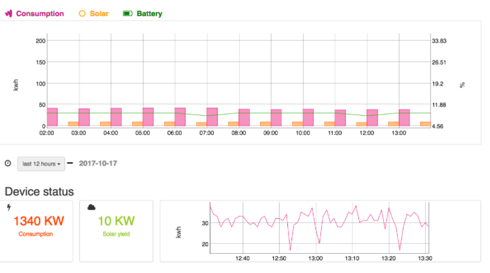

#fgp-js-kit
######How to deploy a standalone FGP-Graph

[](https://github.com/future-grid/fgp-js-kit)

Future Grid JavaScript Library.
  - Dygraph--eric_dygraphs(Reactive, Responsive)
  - Responsive Design
  - Bootstrap(3.*)

# New Features!

  - Support barchart, group-bar chart
  - Buttons and Intervals labels can be hided


You can also:
  - Import and save files from GitHub, Dropbox, Google Drive and One Drive
  - Drag and drop markdown and HTML files into Dillinger
  - Export documents as Markdown, HTML and PDF

fgp-kit-js is a lightweight font-end lib for all Future-Grid's customers. By using this lib they can put their graphs into the other online website or systems.  

### Installation

[fgp-js-kit] uses a number of open source frameworks to work properly:

* [AngularJS1.5.7] - HTML enhanced for web apps!
* [Fontawesome] - icons
* [jQuery] - a fast, small, and feature-rich JavaScript library
* [Dygraph] - graph

But you don't need to install all the libs by yourself.

fgp-js-kit requires [Node.js](https://nodejs.org/) v4+ and [Bower](https://bower.io/) to run.

Install the dependencies and devDependencies and start the server.

```sh
$ cd demo
$ bower init
$ bower install --save fgp-js-kit
```
You will find some javascript libs in bower_components/
[npm]
Not support right now!
[cdn]
Not support right now!

### Manually

You can deploy fgp-js-kit into your web application project or just copy the */dist/* into your project.


### Utilisation & Development

Want to show graphs on the other web system? Great!

Add the sources to your code (adjust paths as needed) after adding the dependencies for Angular and Dygraphs first:

```html
<head>
  // css fgp.kit.bundle.min.css
<head>
<body>
  ...
</body>
  <script src="bower_components/angular/angular.min.js"></script>
  <script src="bower_components/dygraphs/dygraph-combined.js"></script>
  <script src="bower_components/dygraphs/extras/synchronizer.js"></script>
  <!--
   <script src="bower_components/eric_dygraphs/dygraph-combined-dev.js"></script>
   <script src="bower_components/eric_dygraphs/extras/synchronizer.js"></script>
   -->
  <script src="bower_components/fgp-js-kit/dist/fgp.kit.bundle.min.js"></script>
  <script src="**/**/app.js"></script> <!-- create a application js file -->
```

And create a dom ```html <div></div> ``` like this:
```html
<div fgp-container application-name="'node-agent'" device-name="'127.0.0.1'" configuration="configuration" server="'http://localhost:8081'"></div>
```
4 attributes
 - application-name:  Graphs will loading data from "application".(PUF, **-neutral-health)
 - device-name: Device that you are going to look at.(site001, staticon_busbar_001)
 - server: The server that running fgp-rest-ui.(don't forget the port)
 - configuration: widget configuration, you can create your page in fgp platform and then export as a json.(The fgp-js-kit cann't use *.json directly, copy the content to [\*\*/\*app.js])

```sh
angular.module('app', ['fgp-kit']).controller('ctl', function ($scope) {

    $scope.configuration = [{
        "html": "<titlecontainer id=\"item4094\"></titlecontainer>",
        "configTemplate": "",
        "metadata": {
            "css": {
                "color": "green",
                "width": "col-md-12",
                "border": {"color": "#fff"},
                "background": {"color": "#fff"},
                "title": {"text": "device.name", "color": "#5cb85c", "show": true, "minHeight": 100},
                "subtitle": {"text": "\"subtitle\"", "color": "#5cb85c", "show": true}
            }, "other": {}
        },
        "html_render": "<widget-page-title id=\"item4094\" shown></widget-page-title>",
        "parent": "workingArea",
        "id": "item4094"
    }, {
        "html": "<itemcontainer id=\"item7953\"></itemcontainer>",
        "configTemplate": "",
        "metadata": {
            "css": {
                "color": "green",
                "width": "col-md-12",
                "border": {"color": "#218d13"},
                "background": {"color": "#fff"},
                "title": {"text": "Hello", "color": "#5cb85c", "show": true}
            }, "other": {}
        },
        "html_render": "<widget-container id=\"item7953\" shown showTitle></widget-container>",
        "parent": "workingArea",
        "id": "item7953"
    }, {
        "html": "<line-chart-dygraphs-cache id=\"item2715\" style=\"height: 100%;\" type=\"line\"></line-chart-dygraphs-cache>",
        "configTemplate": "",
        "metadata": {
            "css": {"width": "col-md-12", "height": "400"},
            "data": {
                "basic": {"range_show": true, "childrenChart": [], "parentChart": [], "zoom": true},
                "source": {"store": "memory", "relation": "", "device_group": "platform_node", "relation_group": ""},
                "groups": [{
                    "name": "all",
                    "leftYAxis": "Y1",
                    "rightYAxis": "Y2",
                    "collections": [{
                        "name": "substation_va",
                        "rows": [{"label": "label", "value": "value", "color": "#ff0033;", "yaxis": 0}]
                    }]
                }, {
                    "name": "device",
                    "leftYAxis": "Y1",
                    "rightYAxis": "Y2",
                    "collections": [{
                        "name": "raw",
                        "rows": [{"color": "#b85c5c", "label": "FREE", "value": "data.free", "yaxis": "0"}]
                    }, {
                        "name": "5min",
                        "rows": [{
                            "color": "#5cabb8",
                            "label": "max free",
                            "value": "data.maxFree",
                            "yaxis": "0"
                        }, {"color": "#009dff", "label": "avg", "value": "data.avgFree", "yaxis": "1"}]
                    }]
                }, {
                    "name": "relation",
                    "leftYAxis": "Y1",
                    "rightYAxis": "Y2",
                    "collections": [{
                        "name": "substation_va",
                        "rows": [{"label": "label", "value": "value", "color": "#ff1100;", "yaxis": 0}]
                    }]
                }]
            }
        },
        "html_render": "<widget-graph id=\"item2715\" shown type=line></widget-graph>",
        "parent": "edititem7953",
        "id": "item2715"
    }, {
        "html": "<itemcontainer id=\"item9358\"></itemcontainer>",
        "configTemplate": "",
        "metadata": {
            "css": {
                "color": "green",
                "width": "col-md-12",
                "border": {"color": "#2cc80b"},
                "background": {"color": "#fff"},
                "title": {"text": "info", "color": "#5cb85c", "show": true}
            }, "other": {}
        },
        "html_render": "<widget-container id=\"item9358\" shown showTitle></widget-container>",
        "parent": "workingArea",
        "id": "item9358"
    }, {
        "html": "<itemcontainer id=\"item8956\"></itemcontainer>",
        "configTemplate": "",
        "metadata": {
            "css": {
                "color": "green",
                "width": "col-md-12",
                "border": {"color": "#fff"},
                "background": {"color": "#fff"},
                "title": {"text": "title", "color": "#5cb85c", "show": false}
            }, "other": {}
        },
        "html_render": "<widget-container shown id=\"item8956\"></widget-container>",
        "parent": "workingArea",
        "id": "item8956"
    }, {
        "html": "<fgmap id=\"item4372\"></fgmap>",
        "configTemplate": "",
        "metadata": {
            "css": {"width": "col-md-12", "height": "300"},
            "data": [{"label": "latitude", "value": "device.location.latitude"}, {
                "label": "longitude",
                "value": "device.location.longitude"
            }, {"label": "name", "value": "device.location.name"}, {
                "label": "image",
                "value": "http://download.easyicon.net/png/568804/36/"
            }]
        },
        "html_render": "<widget-map id=\"item4372\" shown></widget-map>",
        "parent": "edititem8956",
        "id": "item4372"
    }, {
        "html": "<itemcontainer id=\"item6688\"></itemcontainer>",
        "configTemplate": "",
        "metadata": {
            "css": {
                "color": "green",
                "width": "col-md-12",
                "border": {"color": "#1de403"},
                "background": {"color": "#fff"},
                "title": {"text": "title", "color": "#5cb85c", "show": true}
            }, "other": {}
        },
        "html_render": "<widget-container id=\"item6688\" shown showTitle></widget-container>",
        "parent": "workingArea",
        "id": "item6688"
    }, {
        "html": "<piechart id=\"item3429\"></piechart>",
        "configTemplate": "",
        "metadata": {
            "css": {"width": "col-md-6", "height": "200"},
            "data": [{"label": "totalVah", "value": "30", "color": "#ff0084"}, {
                "label": "current",
                "value": "40",
                "color": "#89ff00"
            }]
        },
        "html_render": "<widget-pie id=\"item3429\" shown></widget-pie>",
        "parent": "edititem6688",
        "id": "item3429"
    }, {
        "html": "<gridtable id=\"item6225\"></gridtable>",
        "configTemplate": "",
        "metadata": {
            "css": {"width": "col-md-12", "height": "400"},
            "data": {
                "basic": {"range_show": true, "childrenChart": [], "parentChart": [], "zoom": true},
                "source": {"store": "memory", "relation": "", "device_group": "platform_node", "relation_group": ""},
                "groups": [{
                    "name": "all",
                    "leftYAxis": "Y1",
                    "rightYAxis": "Y2",
                    "collections": [{
                        "name": "substation_va",
                        "rows": [{"label": "label", "value": "value", "color": "#ff0033;", "yaxis": 0}]
                    }]
                }, {
                    "name": "device",
                    "leftYAxis": "Y1",
                    "rightYAxis": "Y2",
                    "collections": [{
                        "name": "raw",
                        "rows": [{"color": "#b85c5c", "label": "FREE", "value": "data.free", "yaxis": "0"}]
                    }, {
                        "name": "5min",
                        "rows": [{
                            "color": "#5cabb8",
                            "label": "max free",
                            "value": "data.maxFree",
                            "yaxis": "0"
                        }, {"color": "#009dff", "label": "avg", "value": "data.avgFree", "yaxis": "1"}]
                    }]
                }, {
                    "name": "relation",
                    "leftYAxis": "Y1",
                    "rightYAxis": "Y2",
                    "collections": [{
                        "name": "substation_va",
                        "rows": [{"label": "label", "value": "value", "color": "#ff1100;", "yaxis": 0}]
                    }]
                }],
                "chartId": "item2715"
            }
        },
        "html_render": "<widget-chart-table id=\"item6225\" shown></widget-chart-table>",
        "parent": "edititem9358",
        "id": "item6225"
    }];


});
```
All done. enjory~

